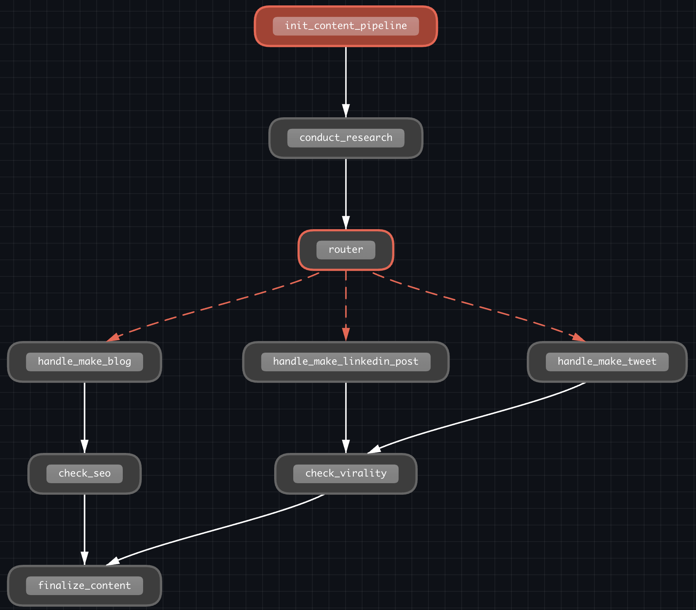

# 0 Introduction

## 0.3 Why So Many Frameworks

- There is no startdard in ai-agent industry yet.
- So We are gonna learn slightly different 5 frameworks.

## 0.4 Course Structure

- high level to low
  - CrewAI
  - MS Autogen
  - OPENAI Agent SDK
  - Google Agent Devkit
  - LangGraph
- agent: just while true loop

## 0.6 Breaking Changes

- Watch and follow as soon as possible
- Adapt to the changes
  - Go to docs and find differences
  - Share differences each other
- Study concepts not specific api or functions

## 1.0 UV

```sh
uv init example-agent
```

## 1.1 PyProject

- install pacakges
  - configurate with pyproject.toml
  - create .venv, uv.lock

```sh
# add pyproject.toml
uv sync
```

- add packages

```sh
uv add {package_name}
```

- how to run
  1. IDE will run source .~
  2. maunally run `source .venv/bin/activate`
     - or in windows `.venv\bin\activate.ps1`
  3. or use `uv run main.py`

- install pylance on vsc

## 1.2 Jupyter

- install Jupyter extension
- create `main.ipynb`

```sh
uv add ipykernel --dev
```

# 2.Your First AI Agent

## 2.0 Setup

```sh
uv init my-first-agent
cd my-first-agent
```

```toml
# my-first-agent/pyproject.toml
[project]
name = "my-first-agent"
version = "0.1.0"
description = "Add your description here"
readme = "README.md"
requires-python = ">=3.13"
dependencies = [
    "openai>=1.98.0",
]

[dependency-groups]
dev = [
    "ipykernel>=6.30.0",
]
```

```sh
uv python pin 3.13
uv sync
```

```sh
OPENAI_API_KEY=xx
```

## 2.1 Your First AI Response

- use cheapest model: gpt-4o-mini
- n=10 will return 10 responses ordered by high probability

## 2.2 Parsing the Response

- AI agent: A system cable of performing actions on behalf of a user
  - not only just replying but also use set of tools user gave
  - It just infer the Text, if it replies with function call, we are the one who have to execute it

## 2.3 Adding Memory

- enable system memory with appending messages in While True loop

## 2.4 Adding Tools

- don't need to write prompt anymore
  - instead of prompt, pass TOOLS schema
- F/W will do TOOLS later
- model will read description and decide

## 2.5 Adding Function Calling

- `**` convert json to argument assignments
- handle optional tool_calls column with process_ai_response(message: ChatCompletionMessage)`

## 2.6 Tool Results

- All AI agent works same way
  - if tool_calls, run tools and append result to messages, then call_ai() again
  - else, just print the message content

# 3 CrewAI: News Reader Agent

## 3.0 Introduction

- highest level framework in this course
- Best for automating workflows
- News curating agent
- Flow gives more control like langGraph

```sh
uv init news-reader-agent
```

## 3.1 Your First CrewAI Agent

- Crew: group of agents
- Agent: an autonomous unit that can
  - perform specific tasks
  - make decisions based on its role and goal
  - use tools to accomplish objectives
- Tasks: detailed guide one managing and creating tasks

- store prompts separately with python code in `config/*.yaml`

```sh
mkdir -p news-reader-agent/config
touch news-reader-agent/config/agents.yaml \
news-reader-agent/config/tasks.yaml \
news-reader-agent/main.py
```

```python
@CrewBase
class TranslatorCrew:
    @agent
    def translator_agent(self):
        return Agent(
            config=self.agents_config["translator_agent"],
        )

    @task
    def translate_task(self):
        return Task(
            config=self.tasks_config["translate_task"],
        )

    @task
    def retranslate_task(self):
        return Task(
            config=self.tasks_config["retranslate_task"],
        )

    @crew
    def assemble_crew(self):
        return Crew(
            agents=self.agents,
            tasks=self.tasks,
            verbose=True,
        )
```

## 3.2 Custom Tools

- create tool -> create function
- instead of defining full schema, just use prompt

```sh
cat <<'EOF' > news-reader-agent/tools.py
from crewai.tools import tool

@tool
def count_letters(sentence: str):
    """
    This function is to count the amount of letters in a sentence.
    The input is a `sentence` string.
    The output is a number.
    """
    print("tool called with input:", sentence)
    return len(sentence)
EOF
```

## 3.3 News Reader Tasks and Agents

- prompting is more important than coding

## 3.4 News Reader Crew

- Search tool: [Serper API](https://serper.dev)
- Scraping tool: playwright, bs4
  - remove unneeded html tags
- Content-harvaest -> summarize

| Mechanism                      | Used in this project? | Description                                                           |
| ------------------------------ | --------------------- | --------------------------------------------------------------------- |
| @task definition order         | ✅                    | self.tasks collected in definition order → determines execution order |
| Sequential Process (default)   | ✅                    | Previous task output automatically passed as next task's context      |
| Explicit context=[] assignment | ❌                    | Not used. Unnecessary since execution is sequential                   |
| Natural language refs in YAML  | ✅                    | Prompts guide the agent on how to utilize previous results            |

```
content_harvesting_task
↓ output (markdown doc: collected news articles)
↓ automatically injected into next task's context
summarization_task
↓ output (markdown doc: multi-level summary)
↓ automatically injected into next task's context
final_report_assembly_task
→ output (final news briefing report)
```

# 4 CrewAI: Job Hunter Agent

## 4.0 Introduction

```sh
uv init job-hunter-agent
```

```toml
[project]
name = "job-hunter-agent"
version = "0.1.0"
description = "Add your description here"
readme = "README.md"
requires-python = ">=3.13"
dependencies = [
    "crewai[tools]>=0.152.0",
    "firecrawl-py==2.16.3",
    "python-dotenv>=1.1.1",
]
```

- Knowledge source feature
- add [FIRECRWLER_API_KEY](https://www.firecrawl.dev/app/api-keys) to .env

## 4.1 Agents and Tasks

- JSON matching with schema can save prompting tokens

```sh
mkdir -p job-hunter-agent/config \
job-hunter-agent/knowledge
touch job-hunter-agent/config/agents.yaml \
job-hunter-agent/config/tasks.yaml \
job-hunter-agent/knowledge/resume.txt
mv job-hunter-agent/hello.py job-hunter-agent/main.py
```

## 4.2 Context And Structured Outputs

- agent is just role playing, task is more important - analyze carefully and write good prompts for tasks
- Structured output with Pydantic models can increase reliability of results

```sh
touch job-hunter-agent/models.py
```

- if the flow is not linear, use `context` field

```python
@task
def interview_prep_task(self):
    return Task(
        config=self.tasks_config["interview_prep_task"],
        context=[
            self.job_selection_task(),
            self.resume_rewriting_task(),
            self.company_research_task(),
        ],
    )
```

## 4.3 Firecrawl Tool

- output_pydantic can convert firecrawl output to pydantic model

```sh
touch job-hunter-agent/tools.py
```

- remove redundant text like `\n` with regex

## 4.4 Knowledge Sources

- give resume to agents

```python
# main.py
resume_knowledge = TextFileKnowledgeSource(
    file_path=[
        "resume.txt",
    ]
)


@CrewBase
class JobHunterCrew:
    # ..
    @agent
    def job_matching_agent(self):
        return Agent(
            config=self.agents_config["job_matching_agent"],
            knowledge_sources=[resume_knowledge],
        )
```

# 5 CrewAI: Content Pipeline Agent

## 5.0 Introduction

- Flows: more control than Crew, less than LangGraph
  - it handles conditional branching

```sh
uv init content-pipeline-agent
cp job-hunter-agent/tools.py content-pipeline-agent/tools.py
cp job-hunter-agent/.env content-pipeline-agent/.env
cat <<'EOF' > content-pipeline-agent/pyproject.toml
[project]
name = "content-pipeline-agent"
version = "0.1.0"
description = "Add your description here"
readme = "README.md"
requires-python = ">=3.13"
dependencies = [
    "crewai[tools]>=0.152.0",
    "firecrawl-py==2.16.3",
    "python-dotenv>=1.1.1",
]
EOF
```

## 5.1 Your First Flow

- class flow
  - has bunch of methods with `and_`, `or_`

```python
class MyFirstFlow(Flow[MyFirstFlowState]):
    @start()
    def first(self):
        print(self.state.user_id)
        print("Hello")

    @listen(first)
    def second(self):
        self.state.user_id = 2
        print("world")
```

- router: control flow with conditions

```python
@router(final)
def route(self):
    if self.state.is_admin:
        return "even"
    else:
        return "odd"
```

- state of flow
  - unstructured
  - can be with pydantic model

```python
class MyFirstFlowState(BaseModel):
    user_id: int = 1
    is_admin: bool = False
```

- plot(): draws diagram

```sh
mv content-pipeline-agent/hello.py content-pipeline-agent/main.py
```

## 5.2 Content Pipeline Flow



## 5.3 Refinement Loop

- we could ask the score of SEO and virality to AI and re-try if it is low score
- listen `remake_*` and conditionally show previous content

## 5.4 LLMs and Agents

- use only one agent

```python
@listen(init_content_pipeline)
def conduct_research(self):

    researcher = Agent(
        role="Head Researcher",
        backstory="You're like a digital detective who loves digging up fascinating facts and insights. You have a knack for finding the good stuff that others miss.",
        goal=f"Find the most interesting and useful info about {self.state.topic}",
        tools=[web_search_tool],
    )

    self.state.research = researcher.kickoff(
        f"Find the most interesting and useful info about {self.state.topic}"
    )
```

- handle_blog_make

```python
class BlogPost(BaseModel):
    title: str
    subtitle: str
    sections: List[str]
#..
@listen(or_("make_blog", "remake_blog"))
def handle_make_blog(self):

    blog_post = self.state.blog_post

    llm = LLM(model="openai/o4-mini", response_format=BlogPost)

    if blog_post is None:
        self.state.blog_post = llm.call(
            f"""
        Make a blog post on the topic {self.state.topic} using the following research:

        <research>
        ================
        {self.state.research}
        ================
        </research>
        """
        )
    else:
        self.state.blog_post = llm.call(
            f"""
        You wrote this blog post on {self.state.topic}, but it does not have a good SEO score because of {self.state.score.reason}

        Improve it.

        <blog post>
        {self.state.blog_post.model_dump_json()}
        </blog post>

        Use the following research.

        <research>
        ================
        {self.state.research}
        ================
        </research>
        """
        )
```

## 5.5 Adding Crews To Flows

- implement handle_make_tweet and handle_make_linkedin_post
- add ViralityCrew and SeoCrew to measure score of virality and SEO

```sh
touch content-pipeline-agent/seo_crew.py \
content-pipeline-agent/virality_crew.py
```

- if there are various tasks, the last ouput of task will be the total ouput of crew

## 5.6 Conclusions

- LLM.call() returns pydantic model properly now.
